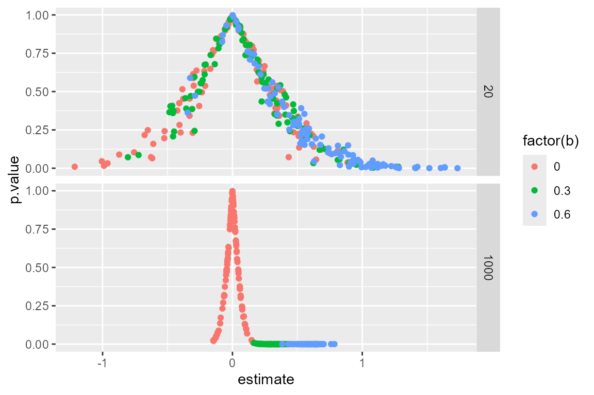

# ResearchDesigns: a library of declared designs

## The idea

To contribute a design to **ResearchDesigns** you just have to place a
self-contained `.R` file in `inst/designs/`. That file declares a design
and, optionally, a short YAML header. Once it is there, the design can
be loaded, modified, diagnosed, and browsed in the bundled Shiny app.

## What a design file looks like

Here is the starter design `two_arm_trial`.

`inst/designs/two_arm_trial.R`

``` r
---
id: two_arm_trial
label: Simple two-arm trial
category: template
keywords: [experiment, two-arm]
description: >
  Simple two-arm trial with complete random assignment.
params:
  "N": "Sample size"
  "b": "Treatment effect"
include_in_shiny: true
---

N <- 1000
b <- 0.2

design <-
  
  declare_model(
    N = N,
    potential_outcomes(Y ~ b * Z + rnorm(N))
  ) +

  declare_inquiry(ATE = mean(Y_Z_1) - mean(Y_Z_0)) +
  
  declare_assignment(Z = complete_ra(N)) +
  
  declare_measurement(Y = reveal_outcomes(Y ~ Z)) +
  
  declare_estimator(Y ~ Z, .method = difference_in_means, inquiry = "ATE")
```

The header is optional. At minimum you need a design object (by default
named `design`). Parameter tips are plain strings under `params:`; quote
keys such as `"N"` and `"b"`.

As soon as that file sits in `inst/designs/`, it is available to
[`make_design()`](https://macartan.github.io/ResearchDesigns/reference/make_design.md),
[`get_args()`](https://macartan.github.io/ResearchDesigns/reference/get_args.md),
[`get_code()`](https://macartan.github.io/ResearchDesigns/reference/get_code.md),
the maintainer audits, and
[`run_shiny()`](https://macartan.github.io/ResearchDesigns/reference/run_shiny.md).

## What designs are included?

``` r

list_designs(discover_params = FALSE)
#> ResearchDesigns library: 6 designs
#> 
#>  id                  alias label                    
#>  pate_with_sampling  4.1   PATE with sampling       
#>  two_arm_trial             Simple two-arm trial     
#>  two_arm_with_blocks       Two-arm trial with blocks
#>  logit_probit_ols    11.5  Logit, probit, or OLS?   
#>  two_arm_trial_rdss  2.1   Two-arm trial from RDSS  
#> 
#> ... and 1 more.
#> 
#> Packages: logit_probit_ols (margins, broom)
#> 
#> See design_info("id") or get_args("id") for details;
#> as.data.frame(list_designs()) for the full table.
```

Call
[`list_designs()`](https://macartan.github.io/ResearchDesigns/reference/list_designs.md)
to see ids, aliases, labels, packages, and (with
`discover_params = TRUE`) modifiable parameters. Use
`design_info("two_arm_trial")` for the English profile of one design, or
`as.data.frame(list_designs())` for the full table.

## Use ResearchDesigns to make a design

``` r

my_design <- make_design("two_arm_trial")
my_design
#> Research design with 5 step(s):
#>   [model] model (dgp)
#>   [inquiry] ATE (inquiry)
#>   [assignment] assignment (dgp)
#>   [measurement] measurement (dgp)
#>   [estimator] estimator (estimator)
```

## Change parameters and simulate

Parameters are taken from the design itself. Pass new values to
[`make_design()`](https://macartan.github.io/ResearchDesigns/reference/make_design.md);
under the hood this uses DeclareDesign’s `redesign()`.

``` r

make_design("two_arm_trial", b = 0.3) |>
  simulate_design(sims = 2)
#> # A tibble: 2 × 14
#>   sim_ID term  estimate std.error statistic     p.value conf.low conf.high    df
#>    <int> <chr>    <dbl>     <dbl>     <dbl>       <dbl>    <dbl>     <dbl> <dbl>
#> 1      1 Z        0.344    0.0617      5.58     3.15e-8    0.223     0.465  998.
#> 2      2 Z        0.343    0.0631      5.44     6.81e-8    0.219     0.467  993.
#> # ℹ 5 more variables: outcome <chr>, estimator <chr>, inquiry <chr>,
#> #   estimand <dbl>, b <dbl>
```

You can now change all parameters in one go.

``` r

make_design("two_arm_trial", b = c(0, .3, .6), N = c(20, 1000)) |>
  simulate_design(sims = 100) |>
  ggplot(aes(estimate, p.value, color = factor(b))) + 
  geom_point()  + facet_grid(N~.)
```



## Browse in Shiny

``` r

run_shiny()
```

The app opens on a searchable library table. Click a row to open the
design, expand its profile, run it once, diagnose it, or redesign
parameters. For a server deploy: install the package, run
[`install_library_dependencies()`](https://macartan.github.io/ResearchDesigns/reference/install_library_dependencies.md),
then `copy_library_shiny(dest)`.

## Maintainer tools

A short set of helpers keeps the library honest:

- [`contributor_checklist()`](https://macartan.github.io/ResearchDesigns/reference/contributor_checklist.md)
  — what a design file should satisfy
- [`audit_designs()`](https://macartan.github.io/ResearchDesigns/reference/audit_designs.md)
  — load each design and check that YAML `params:` names match
  redesignable objects
- [`bake_previews()`](https://macartan.github.io/ResearchDesigns/reference/bake_previews.md)
  — write compact diagnosis previews (`sims = 100` by default) into
  `inst/previews/`
- [`refresh_library()`](https://macartan.github.io/ResearchDesigns/reference/refresh_library.md)
  — index, audit, and bake in one step

Run maintainer helpers from the package source tree, or set:

``` r

options(ResearchDesigns.root = "C:/path/to/ResearchDesigns")
refresh_library()
```

That is the whole loop: drop in a design file, use it from R or Shiny,
and refresh the library when you change the set.
